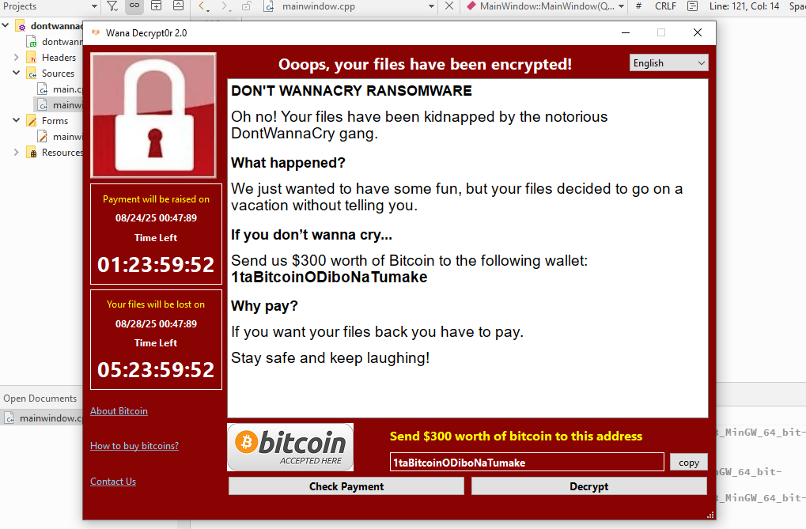
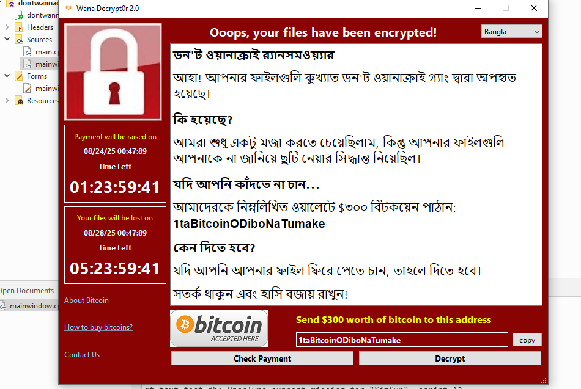

## What it does?
1.Upon running It creates a dummy text file(wannacry.txt) on the current directory & encrypts it.

2. If you click on decrypt button it decrypts the file(wannacry.txt).

## Screenshots

# Original WannaCry

# DontWannaCry Layout

# Ransom Text(English)

# Ransom Text(Bangla)
